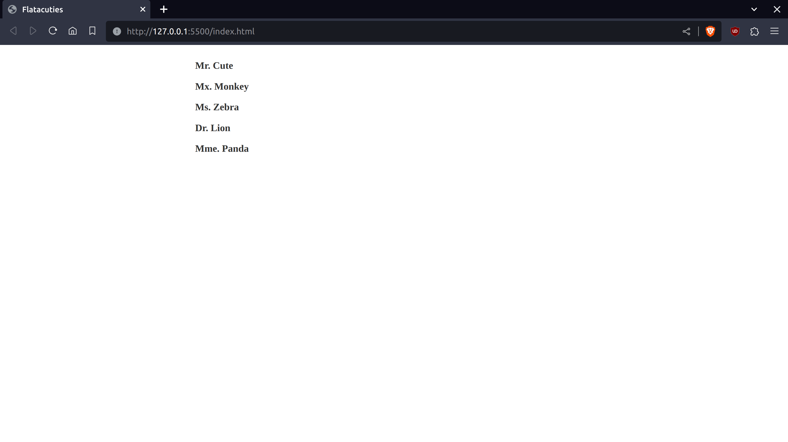
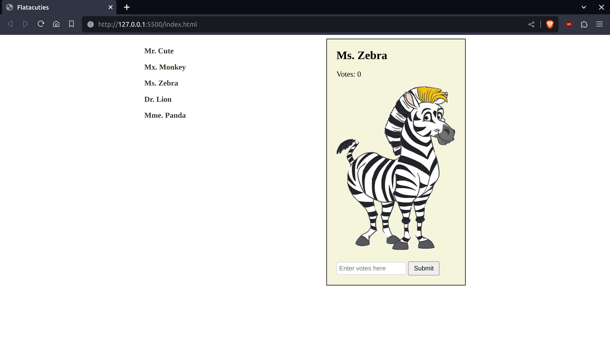

# 🐶 Flatacuties Web App

**_Flataculties, an app where you can vote for the cutest animal!_** 😻

This README.md file provides information about the week 2 code challange solution, creating a simple web app (Flatacuties), including the setup instructions, the web app details, the author & the license.

#  🚀 Getting started 

Before proceeding, make sure to [download](https://github.com/Se7enseads/Code-challenge-2/archive/refs/heads/main.zip) or the recommended to clone the project files onto your machine in order to run any of the projects listed below.

## Git

To clone this repo ensure you have [Git](https://git-scm.com/) installed onto your local machine.

To check if git is already installed, run this command in your terminal:

```bash
git --version
```
### Using https

```bash
git clone https://github.com/Se7enseads/Code-challenge-2.git
```
### Using SSH

```bash
git@github.com:Se7enseads/Code-challenge-2.git
```

For more information about git you can checkout the git [Documentation.](https://git-scm.com/docs)

## JSON Server

To run this challenge you will need a [Mock API (Application Programming Interface)]() or Mock server to create an APi to fetch data from, in our case Charcters.

To start using JSON Server, we need to install it.

1. First check if NPM(Node Package Manager) is already installed:

```bash
npm -v
```
Make sure that the number displayed is greater than 9 or better is the latest. **If so continue to step 3**

**Note:** To download the latest version of , on the command line, run the following command:

```bash
npm install -g npm
```

2. To install npm it is recommended to install via [NVM](https://www.linuxcapable.com/how-to-install-node-js-on-ubuntu-linux/#Section-3-Installing-Nodejs-Using-Node-Version-Manager-NVM) or through the official [Documents](https://github.com/nvm-sh/nvm#install--update-script)

3. We'll install JSON Server globally on your machine via NPM.

```bash
npm install -g json-server
```
With the command above, you should now be able to spin up a mock server from any directory on your computer. 

4. To actually start the JSON Server, run the following command from the same directory that the [name].json file is in. In our case the [name].json is db.json:
```bash
json-server --watch db.json
```

When run, you'll see some messaging about how to access our JSON data. By default, JSON Server will start up on port 3000. You should see a notice that you can access the server at http://localhost:3000


**For more infomation about JSON Server checkout their [homepage.](https://github.com/typicode/json-server)**

# 🐼 Flatacuties Usage

The Flatacuties app will be used for voting for the cutest animal 🦁. When the index.html file in the project folder is run on the browser this what we see. 

**Note:** Make sure the JSON Server is running as in step 4 in Getting Started.



On name click an "animal card" of the corresponding animal appears



Each animal in the db.json has a Name, Number of Votes and an ID. 

Using the [FetchAPI method](https://developer.mozilla.org/en-US/docs/Web/API/Fetch_API) to [GET](https://developer.mozilla.org/en-US/docs/Web/HTTP/Methods/GET)/[Request](https://developer.mozilla.org/en-US/docs/Web/API/Request) the data required. 

Each animal also has a Votes input field where you can Vote for the cutest animals. The data is none persistent meaning when th page changes or refreshes the data is changed back to the default value.

# 📝 Licence

Copyright © 2023 [Kyle Mututo.](https://github.com/Se7enseads)<br />
This project is [MIT](https://github.com/Se7enseads/Code-challenge-2/blob/main/LICENSE) licensed.