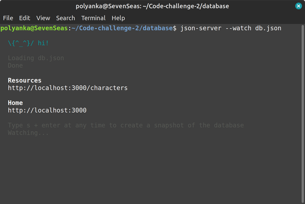

# 🌟 Code Challenge 2

This README.md file provides information about the week 2 code challange solution, including the project setup instructions, author & license.

#  🚀 Getting started 

Before proceeding, make sure to [download](https://github.com/Se7enseads/Code-challenge-2/archive/refs/heads/main.zip) or the recommended to clone the project files onto your machine in order to run any of the projects listed below.

## Git

To clone this repo ensure you have [Git](https://git-scm.com/) installed onto your local machine.

To check if git is already installed, run this command in your terminal:

```bash
git --version
```
### Using https

```bash
git clone https://github.com/Se7enseads/Code-challenge-2.git
```
### Using SSH

```bash
git@github.com:Se7enseads/Code-challenge-2.git
```

For more information about git you can checkout the git [Documentation.](https://git-scm.com/docs)

## JSON Server

To run this challenge you will need a [Mock api]() or Mock server to 

To start using JSON Server, we need to install it, then provide a basic set of data to practice with.

First, we'll install JSON Server globally on your machine:
```bash
npm install -g json-server
```
With the command above, you should now be able to spin up a mock server from any directory on your computer. 

To actually start JSON Server, run the following command from the same directory that the [name].json file is in:
```bash
json-server --watch db.json
```
In our case the [name].json is db.json

When run, you'll see some messaging about how to access our JSON data. By default, JSON Server will start up on port 3000. You should see a notice that you can access the server at http://localhost:3000



# 📝 Licence

Copyright © 2023 [Kyle Mututo.](https://github.com/Se7enseads)<br />
This project is [MIT](https://github.com/Se7enseads/Code-challenge-2/blob/main/LICENSE) licensed.